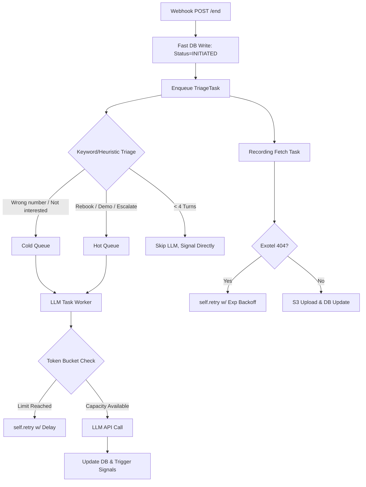

# Post-Call Processing Pipeline — Design Document

**Author:** Akshat  
**Date:** 7th May

---

# 1. Assumptions

## Dynamic Token Cost Estimation

We assume that LLM token usage can be reliably estimated before the API request is made using a simple heuristic formula:

```text
Estimated Tokens = (Transcript Word Count * 1.5) + Base_Prompt_Tokens
```

This allows the Token Bucket rate limiter to deduct a safe “pre-flight” estimate and enforce capacity constraints without waiting for the LLM’s actual usage response.

---

## Triage Feasibility & LLM Bypassing

We assume that the majority of calls can be triaged using fast, non-LLM regex/keyword heuristics applied to transcript text.

Definitive low-value intents such as:

- "wrong number"
- "not interested"
- "already purchased"

can bypass the LLM entirely, preserving token quota for high-value calls.

---

## Downstream Idempotency

We assume downstream systems triggered by `signal_jobs` (CRM integrations, webhooks, etc.) are idempotent.

If signals are replayed after retries or pipeline recovery, they should not create critical duplication.

---

## Independent Assets

LLM analysis depends only on transcript text.

Audio recording availability is independent, meaning:

- Recording fetches
- LLM processing

can execute concurrently.

---

# 2. Architecture Overview

The architecture decomposes the monolithic workflow into an event-driven pipeline with:

- Parallel execution
- Triage lanes
- Capacity-aware scheduling
- Durable state tracking

---

## Flow Diagram



---

# 3. Key Design Decisions

## Parallelization

Recording fetches and LLM processing are split into separate Celery tasks.

This prevents recording delays from blocking transcript analysis.

---

## Pre-flight Triage

A lightweight heuristic classifier routes interactions into:

- **Hot Queue** → urgent/high-value calls
- **Cold Queue** → low-priority calls

This ensures business-critical outcomes process first.

---

## Database as Source of Truth

Postgres stores all durable workflow state.

Redis is used only for:

- ephemeral transport
- token accounting
- queueing
- caching

---

# 4. Rate Limit Management

The system enforces LLM capacity using a Redis-backed Token Bucket Rate Limiter with Lua scripts for atomic operations.

---

## Tracking Rate Limits

We track:

- **Tokens Per Minute (TPM)**

instead of Requests Per Minute (RPM).

Example Redis key:

```text
llm:global_tokens_bucket
```

The bucket:

- initializes to `LLM_TOKENS_PER_MINUTE`
- resets every 60 seconds using TTL

---

## Dynamic Token Estimation

Instead of using a fixed token estimate per call, workers compute a dynamic estimate:

```text
estimated_token_cost =
    (Transcript_Word_Count * 1.5)
    + Base_Prompt_Tokens
```

---

## Capacity Gate

Workers must atomically decrement the estimated token cost from Redis before making the API request.

---

## Prioritization Strategy

### Hot Queue

- Attempts token claims immediately
- Always prioritized

### Cold Queue

Deferred when:

- Hot queue backlog exists
- Token headroom is low

Cold tasks may run in batches during off-peak periods.

---

## When Limits Are Hit

If token acquisition fails:

- Worker does NOT crash
- Worker does NOT trigger API 429s

Instead:

```python
self.retry(countdown=delay)
```

is used to retry after bucket refill.

---

# 5. Per-Customer Token Budgeting

To prevent noisy-neighbor exhaustion, the system uses a:

- **Guaranteed + Burst** allocation model

---

## Allocation Model

Example:

| Customer | Reserved TPM |
|---|---|
| Customer A | 20,000 |
| Customer B | 10,000 |

Stored in:

```sql
customer_budgets
```

---

## Dual Bucket Enforcement

Workers must successfully claim tokens from:

```text
llm:customer:{id}_bucket
AND
llm:global_tokens_bucket
```

---

## Burst Capacity

Optional fallback behavior:

- If customer bucket is empty
- But global pool has surplus

the worker may consume from shared headroom.

---

# 6. Recording Pipeline

The previous:

```python
asyncio.sleep(45)
```

approach is removed.

---

## FetchRecordingTask

Dedicated retryable task:

1. Poll Exotel API
2. If recording exists:
   - Upload to S3
   - Update DB
3. If recording not ready (`404`):
   - Retry with exponential backoff

---

## Retry Schedule

Example backoff:

```text
10s → 20s → 40s → 60s
```

---

## Failure Handling

After max retries:

- `recording_status = 'FAILED'`
- structured ERROR log emitted
- CloudWatch/Datadog alert triggered

---

# 7. Reliability & Durability

Redis is not treated as durable infrastructure.

No analysis result should be permanently lost due to broker failure.

---

## Workflow State Tracking

The `interactions` table stores granular statuses:

- `INITIATED`
- `PENDING_TRIAGE`
- `PENDING_LLM`
- `COMPLETED`
- `FAILED`

---

## Recovery Sweeper

A periodic cron job:

- runs every 5 minutes
- scans Postgres
- finds stuck interactions

Example condition:

```text
PENDING_LLM older than 30 minutes
```

The sweeper re-enqueues dropped tasks.

Even if Redis is flushed entirely, Postgres remains authoritative.

---

# 8. Auditability & Observability

The system relies on:

- Structured JSON Logging
- CloudWatch Logs Insights
- Metric Filters
- Alerting pipelines

---

## Required Log Fields

Every log event MUST include:

| Field | Purpose |
|---|---|
| timestamp | Temporal traceability |
| level | INFO/WARN/ERROR |
| event_name | Queryable lifecycle event |
| interaction_id | Correlation ID |
| customer_id | Customer debugging |
| campaign_id | Billing/debugging |
| duration_ms | Latency tracking |

---

## Example Log Event

```json
{
  "timestamp": "2026-05-07T10:30:00Z",
  "level": "ERROR",
  "event_name": "recording_fetch_failed",
  "interaction_id": "uuid",
  "customer_id": "cust_123",
  "campaign_id": "camp_456",
  "duration_ms": 5020
}
```

---

## Debugging Workflow

CloudWatch Logs Insights query:

```sql
fields @timestamp, event_name, level
| filter interaction_id = "<uuid>"
```

This reconstructs the full interaction lifecycle instantly.

---

# 9. Alert Conditions

CloudWatch Metric Filters generate alarms under the following conditions.

---

## Rate Limit Exhaustion

Condition:

```text
rate_limit_exhausted_count > 100 over 5 minutes
```

Meaning:

- System is healthy
- Calls are queued
- LLM token headroom is nearing exhaustion

---

## Recording Fetch Failure

Condition:

```text
recording_fetch_failed > 0
```

Meaning:

- Exotel failed to provide recording
- SLA breach
- Immediate investigation required

---

## Stuck Interactions

Condition:

```text
interaction_stuck_in_pending > X
```

Meaning:

- Worker starvation
- Queue delivery failure
- Infrastructure degradation

---

# 10. Data Model

```sql
-- Track pipeline state independently from call state
ALTER TABLE interactions 
ADD COLUMN processing_status VARCHAR(50) DEFAULT 'INITIATED',
ADD COLUMN priority_lane VARCHAR(20) DEFAULT 'unassigned',
ADD COLUMN recording_status VARCHAR(20) DEFAULT 'pending',
ADD COLUMN tokens_consumed INTEGER DEFAULT 0;

CREATE INDEX idx_interactions_processing_status
ON interactions(processing_status);

-- Customer budgeting table
CREATE TABLE customer_budgets (
    customer_id UUID PRIMARY KEY,
    tokens_per_minute_limit INTEGER NOT NULL,
    created_at TIMESTAMPTZ DEFAULT NOW(),
    updated_at TIMESTAMPTZ DEFAULT NOW()
);
```

---

# 11. Security

Sensitive data includes:

- transcript PII
- financial information
- call recordings

---

## Data At Rest

Recommended protections:

### Preferred

Application-level encryption using AWS KMS before storing transcript payloads.

### Minimum

Enable RDS encryption/TDE.

---

## Data In Transit

S3 buckets must remain private.

Dashboards should use:

- short-lived pre-signed URLs

instead of permanent recording links.

---

# 12. Trade-offs & Alternatives Considered

| Option | Why Considered | Why Rejected / Alternative Chosen |
|---|---|---|
| Exact Tokenizer (`tiktoken`) | 100% accurate token prediction | CPU-heavy and slower than heuristic estimation |
| Kafka/SQS | Durable queues | Too large an infra migration for current scope |
| Recording Ready Webhooks | Most efficient delivery mechanism | External webhook reliability concerns |
| Strict SQL Columns for LLM Output | Strong schema guarantees | JSONB provides schema flexibility |
| Lightweight Local NLP Model | Better triage accuracy | Regex is simpler and operationally cheaper |

---

# 13. Known Weaknesses

## Heuristic Triage Limitations

Regex-based triage may misclassify:

- sarcasm
- nuanced rejection
- Hinglish
- implicit sentiment

Final LLM classification still corrects this eventually.

---

## Temporary Token Leakage

If a worker crashes after token reservation but before API execution:

- reserved tokens are leaked temporarily
- leakage resolves automatically after TTL reset

---

# 14. Future Improvements

## Exact Token Counting

Integrate asynchronous `tiktoken` estimation during triage for precise TPM accounting.

---

## Durable Queue Infrastructure

Replace Redis broker with:

- RabbitMQ
- AWS SQS

to eliminate sweeper recovery logic.

---

## Dead Letter Queue (DLQ) Dashboard

Build operational tooling for:

- failed task inspection
- replay workflows
- manual recovery


## 15. What I Would Do With More Time

1. **Gradual Dialer Backpressure (Feedback Loop):** I left out an active feedback loop to the dialer. Ideally, I would implement a mechanism that monitors the `llm_hot` queue depth; if the queue exceeds 5,000 tasks, it would signal the dialer to gracefully reduce its outbound call rate by 20% until the queue drains, creating a smooth throttle rather than a hard freeze.
2. **Inbound Webhook Idempotency:** Telephony providers (Exotel) sometimes retry webhooks if network latency is high. If Exotel sends the same call-end event twice, our system might enqueue two identical processing tasks. I left out a Redis-based idempotency key (using `call_sid` with a 24-hour TTL) which would immediately return a 200 OK for duplicate webhooks, preventing duplicate token spend.
3. **Dead Letter Queue (DLQ):** I focused heavily on the core LLM rate-limiting, but left the downstream CRM push (`signal_jobs.py`) as a mock. Because external CRM APIs frequently rate-limit or timeout, I would eventually build a dedicated Celery task for CRM syncing with its own exponential backoff, plus a Dead Letter Queue (DLQ) dashboard for operations to manually replay permanently failed webhook syncs.